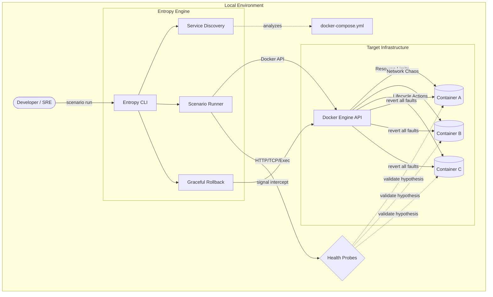

<div align="center">
  
</div>

[](https://goreportcard.com/report/github.com/ibrahimkizilarslan/entropy)
[](https://opensource.org/licenses/MIT)
[](https://github.com/ibrahimkizilarslan/entropy/actions/workflows/ci.yml)
[](https://go.dev/)
[](https://github.com/ibrahimkizilarslan/entropy/releases)

Entropy is a **developer-first chaos engineering engine** designed to inject controlled faults into distributed microservice environments. 

Written entirely in **Go** as a high-performance, single-binary distribution, Entropy helps teams validate system resilience, identify single points of failure, and confidently test hypothesis-driven scenarios before code ever reaches production.

## Core Capabilities

- **Smart Context Discovery:** Zero-configuration setup. Automatically detects Docker Desktop, native Linux sockets, and `docker-compose.yml` topologies to map your system instantly.
- **Hypothesis-Driven Scenarios:** Define deterministic chaos experiments using a declarative YAML DSL. Execute actions, wait for state propagation, and probe APIs.
- **Multi-Protocol Probes (NEW!):** Don't just ping HTTP endpoints. Verify infrastructure health using **TCP socket checks** and **Docker Exec probes** to run raw shell commands (like `redis-cli ping`) inside containers.
- **Graceful Rollback:** Safety first. If you abort an experiment with `Ctrl+C`, Entropy intercepts the signal and automatically reverts all injected chaos (unpauses containers, removes CPU limits) leaving your system pristine.
- **Resource Constraints:** Dynamically enforce CPU quotas and Memory limits on active containers.
- **Network Degradation:** Inject precise network latency, packet loss, and jitter using Linux `tc` and `netem`.

## See it in action

<!-- Replace the source below with your actual GIF recording once ready -->


## Architecture & Vision

Entropy acts as the chaos injection layer for modern dev environments. By simulating real-world catastrophic failures (database crashes, network partitions, CPU starvation) locally, developers can implement patterns like *Graceful Degradation* and *Circuit Breaking* effectively.



Future iterations will introduce `KubernetesClient` adapters, allowing the exact same scenario configurations to seamlessly transition from a developer's laptop to staging clusters.


## Installation

You can install Entropy using Go or by building from source.

## Prerequisites

- **Go:** `1.22.2+` (from `go.mod`)
- **Docker:** Running local Docker daemon (Docker Desktop or native Linux engine)
- **Compose files for discovery:** `docker-compose.yml`, `docker-compose.yaml`, or `compose.yaml`
- **OS support:** Linux, macOS, and Windows for Docker-based chaos actions
- **Network chaos dependencies (Linux host only):** `sudo`, `nsenter`, and `tc`/`netem` are required for `delay` and `loss` actions

### Method 1: Global Install (Recommended)
This installs the binary to your `$GOPATH/bin` folder, allowing you to run it from anywhere.

```bash
go install github.com/ibrahimkizilarslan/entropy/cmd/entropy@latest
```
> [!TIP]
> Ensure your Go bin directory is in your system's `PATH`.
> - **Unix (Linux/macOS):** `export PATH=$PATH:$(go env GOPATH)/bin`
> - **Windows:** Add `%GOPATH%\bin` to your Environment Variables.

### Method 2: Build from Source
If you want to contribute or build locally:

```bash
git clone https://github.com/ibrahimkizilarslan/entropy.git
cd entropy
go mod download
go build -o entropy ./cmd/entropy
```

### Method 3: Install from Releases
Download a prebuilt binary from the [Releases](https://github.com/ibrahimkizilarslan/entropy/releases) page for your platform, then:

- Place it in a directory in your `PATH`
- Ensure it is executable (`chmod +x entropy` on Unix-like systems)

---

## Quick Start

> [!IMPORTANT]
> If you built from source and the binary is in your current directory, you must use `./entropy` (Linux/macOS) or `.\entropy` (Windows) to run it.

### 1. Auto-Discovery
Navigate to any directory containing a `docker-compose.yml` file and initialize the workspace:

**Unix (Linux/macOS):**
```bash
./entropy init
```

**Windows (PowerShell):**
```bash
.\entropy init
```

This generates a `chaos.yaml` configuration populated with your discovered services.

### 2. Scenario-Based Testing
Execute deterministic, hypothesis-driven tests:

```bash
./entropy scenario run chaos-scenario.example.yaml
```

### 3. Random Fault Injection
Start the background daemon to randomly inject faults:

```bash
./entropy start --detach
./entropy status
./entropy stop
```

### 4. Concrete Example Output
Real output from `./entropy --help`:

```text
Usage:
  entropy [command]

Available Commands:
  cleanup     Emergency cleanup: revert all active faults
  docker      Docker utility commands
  doctor      Analyze your docker-compose topology for enterprise resilience and anti-patterns
  init        Auto-discover docker-compose.yml and generate a chaos.yaml file
  inject      Manually inject a single chaos action into a target container
  logs        Stream the logs generated by the background chaos engine
  scenario    Run deterministic chaos scenarios
  start       Start the chaos engine. Use --detach / -d to run in the background.
  status      Show the status of the chaos engine
  stop        Stop a running background chaos engine
  topology    Visualize the cluster topology and blast radius
```

### 5. End-to-End Smoke Test
Run the full command-level sanity check:

```bash
./scripts/e2e-smoke.sh
```

Run it with automatic demo environment lifecycle:

```bash
./scripts/e2e-smoke.sh --with-demo-compose
```

---

## Troubleshooting: "Command Not Found"

If you see `entropy: command not found`, it is likely for one of two reasons:

1. **Current Directory:** You built the binary locally but are not using `./` or `.\` to run it. Use `./entropy` instead of just `entropy`.
2. **PATH Issue:** You used `go install` but your Go bin directory is not in your system's PATH. See the [Installation](#-installation) section for details.

## Documentation

For a deep dive into configuring and running Entropy, check out the documentation:

- [Scenario DSL Reference](docs/scenarios.md) - Learn how to write deterministic chaos scenarios.
- [Random Chaos Engine](docs/random-chaos.md) - Details on background daemon configuration.
- [CLI Reference](docs/cli-reference.md) - Full list of available CLI commands.
- [Release Checklist](docs/release-checklist.md) - Launch and release readiness checklist.

## Contributing

We welcome contributions! Whether it's adding new chaos actions, fixing bugs, or improving documentation, please see our [Contributing Guide](CONTRIBUTING.md) to get started.

Please also review:
- [Security Policy](SECURITY.md)
- [Changelog](CHANGELOG.md)

If Entropy helps your team test resilience earlier, consider starring the project and checking the [Star History](https://star-history.com/#ibrahimkizilarslan/entropy&Date).

## License

This project is licensed under the MIT License - see the [LICENSE](LICENSE) file for details.
