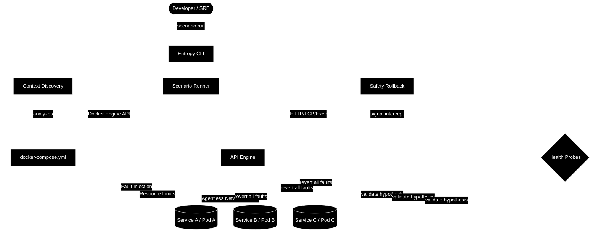

<div align="center">
  
</div>

[](https://goreportcard.com/report/github.com/ibrahimkizilarslan/entropy)
[](https://opensource.org/licenses/MIT)
[](https://github.com/ibrahimkizilarslan/entropy/actions/workflows/ci.yml)
[](https://go.dev/)
[](https://github.com/ibrahimkizilarslan/entropy/releases)

> 🚀 **v3.0.0 RELEASED — Security & Reliability Hardening**
> This release closes out a full engineering-quality pass: fail-closed target
> validation, an exec-probe allowlist, dial-time SSRF protection, a real
> production-environment guard, per-target concurrency (no more lock
> contention between unrelated chaos targets), a responsive Ctrl+C on the
> random-chaos daemon, and a hardened CI pipeline (`golangci-lint` +
> `govulncheck` on every PR). **Contains breaking changes** — see
> [Upgrading to v3.0.0](#upgrading-to-v300) before updating.

Entropy is a **developer-first, platform-agnostic chaos engineering engine** designed to inject controlled faults into distributed microservice environments.

Written entirely in **Go** as a high-performance, single-binary distribution, Entropy helps teams validate system resilience, identify single points of failure, and confidently test hypothesis-driven scenarios. From local `docker-compose` topologies to production Kubernetes clusters, Entropy provides a seamless experience without requiring heavy agent installations.

## See it in action


## Core Capabilities

- **Platform Agnostic (Docker & Kubernetes):** Use a single CLI flag (`--runtime=kubernetes`) to seamlessly transition from your local laptop to staging clusters.
- **Agentless Architecture (K8s):** Entropy uses modern **Ephemeral Containers** (`nicolaka/netshoot`) to inject chaos directly into target Pods. No DaemonSets, no node-level agents, zero footprint left behind.
- **Smart Context Discovery:** Zero-configuration setup. Automatically detects Kubernetes namespaces, `Deployment`s, `StatefulSet`s, Docker Desktop, and `docker-compose.yml` topologies to map your system instantly.
- **Enterprise Resilience Doctor:** Analyze your topology for Single Points of Failure (SPOF), missing resource limits, missing probes, and privileged containers using `entropy doctor`.
- **Topology Visualization:** Map your system's architecture and analyze the potential blast radius of failures with `entropy topology`.
- **Hypothesis-Driven Scenarios:** Define deterministic chaos experiments using a declarative YAML DSL. Execute actions, wait for state propagation, and probe APIs.
- **Multi-Protocol Probes:** Don't just ping HTTP endpoints. Verify infrastructure health using **TCP socket checks** and **Docker/K8s Exec probes** to run safe diagnostic commands inside containers, protected by a read-only command allowlist.
- **Graceful Rollback:** Safety first. If you abort an experiment with `Ctrl+C`, Entropy intercepts the signal and automatically reverts all injected chaos (unpauses containers, removes ephemeral containers) leaving your system pristine — and the daemon's random-chaos loop stays responsive to `Ctrl+C` even mid-injection.
- **Network Degradation:** Inject precise network latency, packet loss, and jitter using Linux `tc` and `netem`.
- **Crash-Safe by Design:** A persistent, atomic fault registry means the engine can crash, get OOM-killed, or be forcefully restarted without leaving orphaned chaos behind.

## Security by Default

Entropy intentionally disrupts running services — so its own safety rails
matter as much as the chaos it injects. As of v3.0.0:

- **Fail-closed target validation.** `entropy inject` refuses to run if its
  allow-list config can't be loaded, instead of silently allowing *any*
  container/pod on the host. Bypass only via explicit `--skip-validation`.
- **Allowlisted exec probes.** Scenario `exec` probes only permit a small set
  of read-only diagnostic commands (`cat`, `ls`, `stat`, `ps`, `grep`, …) —
  not a blocklist of "known-bad" commands, which is trivially bypassed.
  Extend it with `ENTROPY_EXEC_ALLOWLIST`.
- **Dial-time SSRF protection.** `http`/`tcp` probe targets are validated
  against the *actual IP being connected to* (via `net.Dialer.Control`), not
  just the hostname — closing the DNS-rebinding gap a hostname-only check
  would miss. Cloud metadata endpoints are always blocked.
- **A production guard that actually guards.** Entropy refuses to start
  against a Docker context or Kubernetes cluster whose name looks like
  production (`prod-us-east`, `acme-production`, …), not just an opt-in env
  var nobody remembers to set.

See [SECURITY.md](SECURITY.md) for the full policy and [CHANGELOG.md](CHANGELOG.md#300---2026-07-18) for implementation details.

## Crash-Safe Architecture

**Key Architectural Advancements:**
- **Persistent Fault Registry (Atomic State File):** Entropy maintains a durable, atomic record of all active chaos injections (stored locally at `~/.entropy/registry.json`). Every write is a full state snapshot committed via the write-temp → fsync → rename pattern (plus a parent-directory fsync for rename durability), never a partial or corrupt file, even if the process is killed mid-write.
- **Auto-Recovery on Boot:** If the `entropy` daemon process is OOM-killed, forcefully terminated (`kill -9`), or unexpectedly restarted, it will read the fault registry upon booting, discover orphaned chaos rules on the cluster/docker engine, and automatically revert them before starting a new session.
- **Background Expiry Watcher:** A background garbage collector continuously monitors for any chaos injections that failed to revert due to goroutine scheduling issues or system hangs, providing an extra layer of safety.
- **Unified Local State:** We unified state tracking for BOTH Docker and Kubernetes targets via the same local registry file. This keeps Entropy dependency-free and avoids the need for cluster-admin privileges (no CRDs required).
- **Per-Target Concurrency:** Network and resource chaos injection/revert use per-target locking — a slow operation on one container (a stalled Docker exec, a hung Kubernetes SPDY stream) no longer blocks injection or revert on every other container.

## Why Entropy?

Unlike traditional chaos engineering tools that are often heavy, Kubernetes-only, or require complex control planes, Entropy is built specifically for developer agility.

| Feature | Entropy | Chaos Mesh | LitmusChaos | Chaos Monkey |
|---------|---------|------------|-------------|--------------|
| **Target Runtime** | Docker & Kubernetes | K8s only | K8s only | AWS / Spinnaker |
| **Architecture** | Agentless (Ephemeral/Exec) | DaemonSet | DaemonSet / CRDs | Agent / API |
| **Setup Complexity** | Zero-config (Single binary) | High (Helm + CRDs) | High (Helm + CRDs) | High |
| **Local Testing** | ✅ First-class support | ❌ Difficult | ❌ Difficult | ❌ No |
| **Scenario DSL** | ✅ Yes (YAML) | ✅ Yes | ✅ Yes | ❌ Random only |
| **SSRF Protection** | ✅ Dial-time, built-in | ❌ Manual | ❌ Manual | ❌ N/A |

## Architecture & Vision

Entropy acts as the chaos injection layer for modern dev and staging environments. By simulating real-world catastrophic failures (database crashes, network partitions, CPU starvation), developers can implement patterns like *Graceful Degradation* and *Circuit Breaking* effectively.

Our vision is to provide a truly **agentless** experience. In Kubernetes, this means leveraging **Ephemeral Containers** to dynamically attach networking utilities (like `tc`) to target Pods exactly when needed, entirely eliminating the security risks and resource overhead of traditional DaemonSet-based chaos tools.


```mermaid
%%{init: {
  'theme': 'base',
  'themeVariables': {
    'primaryColor': '#000',
    'primaryTextColor': '#fff',
    'primaryBorderColor': '#fff',
    'lineColor': '#fff',
    'secondaryColor': '#000',
    'tertiaryColor': '#000',
    'mainBkg': '#000',
    'clusterBkg': 'none',
    'clusterBorder': 'none',
    'fontFamily': 'monospace'
  }
}}%%
graph TD
    User([Developer / SRE]) -->|scenario run| CLI[Entropy CLI]
    
    subgraph "Entropy Control Plane"
        CLI --> Discovery[Context Discovery]
        CLI --> Runner[Scenario Runner]
        CLI --> Safety[Safety Rollback]
    end
    
    Discovery -.->|analyzes| Compose[docker-compose.yml]
    
    subgraph "Target Infrastructure"
        Runner -->|Docker Engine API| API[API Engine]
        API -->|Fault Injection| C1[(Service A / Pod A)]
        API -->|Resource Limits| C2[(Service B / Pod B)]
        API -->|Agentless Network Chaos| C3[(Service C / Pod C)]
    end
    
    Runner -->|HTTP/TCP/Exec| Probes{Health Probes}
    Probes -.->|validate hypothesis| C1 & C2 & C3
    
    Safety -->|signal intercept| API
    API -->|revert all faults| C1 & C2 & C3

    %% Pure black and white styling
    classDef default fill:#000,stroke:#fff,color:#fff,stroke-width:1px;
    classDef sub fill:none,stroke:none,color:#fff;
    
    class User,CLI,Discovery,Runner,Safety,API,C1,C2,C3,Probes default;
```

The engine abstracts the underlying runtime via a `ContainerRuntime` factory, meaning the exact same `chaos.yaml` scenario definitions run flawlessly whether you are targeting a local `docker-compose` stack or a remote Kubernetes cluster.


## Installation

You can install Entropy using Go or by building from source.

## Prerequisites

- **Go:** `1.26.5+` (from `go.mod`)
- **Docker:** Running local Docker daemon (Docker Desktop or native Linux engine)
- **Compose files for discovery:** `docker-compose.yml`, `docker-compose.yaml`, or `compose.yaml`
- **OS support:** Linux, macOS, and Windows for Docker-based chaos actions
- **Network chaos dependencies:** `delay`/`loss` actions run `tc`/`netem` *inside* the target container (via `exec`) — the target image needs `iproute2` and the `NET_ADMIN` capability. No host-level `sudo`/`nsenter` required.

### Method 1: Global Install (Recommended)
This installs the binary to your `$GOPATH/bin` folder, allowing you to run it from anywhere.

```bash
go install github.com/ibrahimkizilarslan/entropy/cmd/entropy@latest
```
> [!TIP]
> Ensure your Go bin directory is in your system's `PATH`.
> - **Unix (Linux/macOS):** `export PATH=$PATH:$(go env GOPATH)/bin`
> - **Windows:** Add `%GOPATH%\bin` to your Environment Variables.

### Method 2: Build from Source
If you want to contribute or build locally:

```bash
git clone https://github.com/ibrahimkizilarslan/entropy.git
cd entropy
go mod download
go build -o entropy ./cmd/entropy
```

### Method 3: Install from Releases
Download a prebuilt binary from the [Releases](https://github.com/ibrahimkizilarslan/entropy/releases) page for your platform, then:

- Place it in a directory in your `PATH`
- Ensure it is executable (`chmod +x entropy` on Unix-like systems)

---

## Quick Start

> [!IMPORTANT]
> If you built from source and the binary is in your current directory, you must use `./entropy` (Linux/macOS) or `.\entropy` (Windows) to run it.

### 1. Auto-Discovery
Navigate to any directory containing a `docker-compose.yml` file and initialize the workspace:

**Unix (Linux/macOS):**
```bash
./entropy init
```

**Windows (PowerShell):**
```bash
.\entropy init
```

This generates a `chaos.yaml` configuration populated with your discovered services.

### 2. Scenario-Based Testing
Execute deterministic, hypothesis-driven tests:

```bash
./entropy scenario run chaos-scenario.example.yaml
```

### 3. Random Fault Injection
Start the background daemon to randomly inject faults:

```bash
./entropy start --detach
./entropy status
./entropy stop
```

### 4. Concrete Example Output
Real output from `./entropy --help`:

```text
Usage:
  entropy [command]

Available Commands:
  cleanup     Emergency cleanup: revert all active faults
  completion  Generate the autocompletion script for the specified shell
  docker      Docker utility commands
  doctor      Analyze your topology (docker-compose or kubernetes) for enterprise resilience and anti-patterns
  help        Help about any command
  init        Auto-discover targets (docker-compose or kubernetes) and generate a chaos.yaml file
  inject      Manually inject a single chaos action into a target container
  logs        Stream the logs generated by the background chaos engine
  registry    Manage the persistent fault registry
  scenario    Run deterministic chaos scenarios
  start       Start the chaos engine. Use --detach / -d to run in the background.
  status      Show the status of the chaos engine
  stop        Stop a running background chaos engine
  topology    Visualize the cluster topology and blast radius
  validate    Validate a chaos configuration file without executing it
  version     Print the entropy version
```

### 5. End-to-End Smoke Test
Run the full command-level sanity check:

```bash
./scripts/e2e-smoke.sh
```

Run it with automatic demo environment lifecycle:

```bash
./scripts/e2e-smoke.sh --with-demo-compose
```

---

## Upgrading to v3.0.0

v3.0.0 closes two security gaps that previously allowed unsafe fallback
behavior. Both changes are intentional and **not** backward compatible:

1. **`entropy inject` now fails closed.** If its allow-list config
   (`chaos.yaml` by default) can't be loaded, `inject` refuses to run instead
   of silently allowing any target. If you rely on running `inject` without a
   config file, pass `--skip-validation` explicitly going forward.
2. **Exec probe commands are now allowlisted, not blocklisted.** Only a small
   set of read-only diagnostics is permitted by default (`cat`, `ls`, `stat`,
   `test`, `true`, `false`, `echo`, `pgrep`, `ps`, `head`, `tail`, `wc`,
   `grep`). If your scenarios use `exec` probes with other commands, set
   `ENTROPY_EXEC_ALLOWLIST` (comma-separated) to extend the allowlist.

See the [v3.0.0 changelog entry](CHANGELOG.md#300---2026-07-18) for the complete list of changes, including non-breaking security and reliability improvements.

---

## Troubleshooting: "Command Not Found"

If you see `entropy: command not found`, it is likely for one of two reasons:

1. **Current Directory:** You built the binary locally but are not using `./` or `.\` to run it. Use `./entropy` instead of just `entropy`.
2. **PATH Issue:** You used `go install` but your Go bin directory is not in your system's PATH. See the [Installation](#-installation) section for details.

---

## Configuration & Environment

Entropy can be configured via flags or environment variables:

| Environment Variable | Description | Default |
|----------------------|-------------|---------|
| `ENTROPY_K8S_NAMESPACE` | Kubernetes namespace to target | `default` |
| `ENTROPY_NET_INTERFACE` | Network interface for `tc` injection | `eth0` |
| `KUBECONFIG` | Path to your Kubernetes config file | `~/.kube/config` |
| `ENTROPY_REGISTRY_PATH` | Path to the persistent fault registry file | `~/.entropy/registry.json` |
| `ENTROPY_ALLOW_PRODUCTION` | Bypass the production-environment guard | `false` |
| `ENTROPY_ALLOW_PRIVATE_NETWORKS` | Allow `http`/`tcp` scenario probes to target private/loopback/link-local IPs. Cloud metadata IPs are always blocked regardless. | `true` |
| `ENTROPY_EXEC_ALLOWLIST` | Comma-separated list of additional executables permitted in `exec` scenario probes | *(none)* |

## Documentation

For a deep dive into configuring and running Entropy, check out the documentation:

- [Scenario DSL Reference](docs/scenarios.md) - Learn how to write deterministic chaos scenarios.
- [Random Chaos Engine](docs/random-chaos.md) - Details on background daemon configuration.
- [CLI Reference](docs/cli-reference.md) - Full list of available CLI commands.
- [Release Checklist](docs/release-checklist.md) - Launch and release readiness checklist.

## Contributing

We welcome contributions! Whether it's adding new chaos actions, fixing bugs, or improving documentation, please see our [Contributing Guide](CONTRIBUTING.md) to get started.

Please also review:
- [Security Policy](SECURITY.md)
- [Changelog](CHANGELOG.md)

If Entropy helps your team test resilience earlier, consider starring the project and checking the [Star History](https://star-history.com/#ibrahimkizilarslan/entropy&Date).

## License

This project is licensed under the MIT License - see the [LICENSE](LICENSE) file for details.
